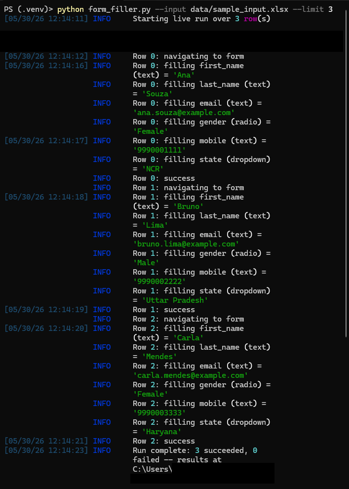
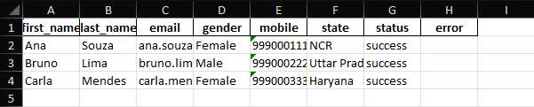
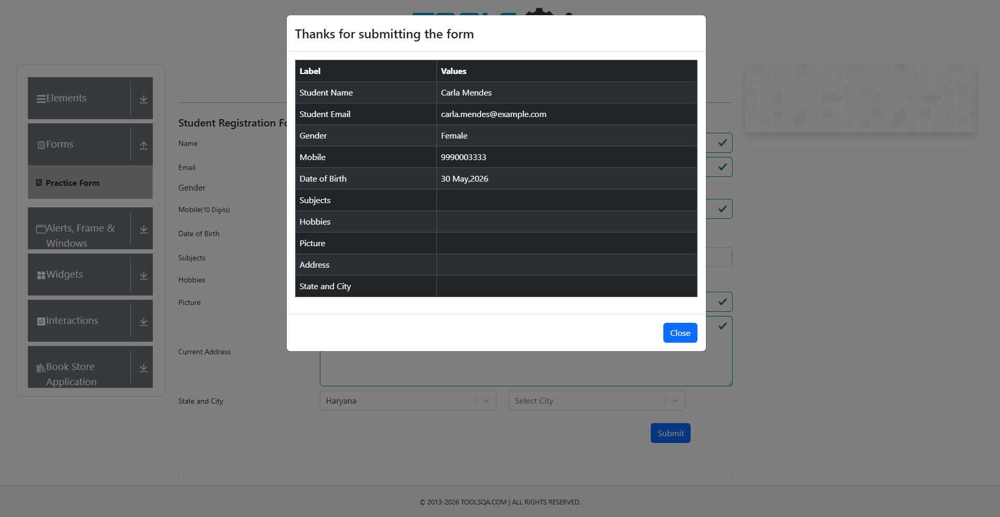

# Form Filler Automation

> A spreadsheet-driven Selenium bot that fills any web form via a YAML
> configuration. One Python codebase, infinite target forms — point it
> at a different page by editing `config.yaml`, no Python changes
> required.


<p align="center">
  
</p>

---

## Features

- **Spreadsheet-driven** — one row in `.xlsx` / `.csv` becomes one form submission.
- **Form-agnostic** — every selector, URL, and field type lives in `config.yaml`. Point at a new form by editing the YAML alone.
- **All standard field types** — text, dropdown (incl. React-Select), radio, checkbox, date.
- **Per-row isolation** — a failure on row N is logged and recorded as `status="error"` but never derails rows N+1.
- **Proof of work** — every submission produces a PNG screenshot plus a status row in `output/results.xlsx`.
- **Robust waits** — Selenium `WebDriverWait` everywhere, zero hard-coded `time.sleep` on the hot path.
- **Retry with exponential backoff** — transient page hiccups are retried 0.5s, 1s, 2s, ... apart (configurable).
- **Dry-run mode** — `--no-submit` fills every field but skips the submit click; safe for validating against real systems without creating records.
- **Anti-detection out of the box** — the bot removes the "controlled by automation" banner, hides the `navigator.webdriver` flag, and uses a human-sized viewport.
- **Rich console + persistent log** — colour-coded progress on the terminal, plain-text mirror in `logs/run.log`.
- **52 unit tests** — driver, waits, fields, dispatcher, I/O, logger and CLI parser, all with mocked WebDriver (no real browser required to run the suite).

---

## Demo target

Built and demonstrated against [DemoQA — Automation Practice Form](https://demoqa.com/automation-practice-form),
a public form built for automation practice. The site provides a rich
mix of inputs (text, radio, checkbox, dropdown, date), exactly what
proves competence in form automation.

> **Disclaimer**: This project is intended for educational and portfolio
> purposes only. The included demo targets a public practice form. Always
> review and respect a site's Terms of Service before automating
> interactions with it.

---

## Requirements

- Python **3.10** or newer
- Google Chrome installed (any recent version)
- Internet connection (Selenium Manager downloads the matching
  ChromeDriver on first run)

---

## Installation

```powershell
# 1. Clone the repository
git clone https://github.com/Soares-Matheus/form-filler-automation.git
cd form-filler-automation

# 2. Create and activate a virtual environment
python -m venv .venv
.venv\Scripts\Activate.ps1            # Windows PowerShell
# source .venv/bin/activate           # macOS / Linux

# 3. Install dependencies
pip install -r requirements.txt

# 4. Run the tests to confirm everything works
pytest -v
```

Expected outcome: `52 passed in ~0.5s`.

---

## Configuration

Behaviour and target form are controlled by `config.yaml`:

```yaml
target:
  url: "https://demoqa.com/automation-practice-form"
  submit_selector: "#submit"
  confirmation_selector: ".modal-content"

behavior:
  headless: false         # set true for unattended / CI runs
  timeout: 10             # WebDriverWait default in seconds
  retries: 2              # extra attempts per row before marking error

fields:
  first_name:
    type: text
    selector: "#firstName"
  gender:
    type: radio
    selector: "label[for^='gender-radio']"
  state:
    type: dropdown
    selector: "#state"
  # ... add as many fields as your form needs
```

Each key under `fields:` **must match a column name in the input
spreadsheet**. Supported `type` values are: `text`, `dropdown`, `radio`,
`checkbox`, `date`.

To target a different form: change the `url`, replace the selectors,
done. No Python changes.

---

## Usage

```powershell
# Default: open Chrome, process every row, submit each one
python form_filler.py --input data/sample_input.xlsx

# Smoke-test: process only the first 3 rows
python form_filler.py --input data/sample_input.xlsx --limit 3

# Unattended run (no visible browser)
python form_filler.py --input data/sample_input.xlsx --headless

# Dry-run: fill but DO NOT submit (useful against real client systems)
python form_filler.py --input data/sample_input.xlsx --no-submit

# Mix and match
python form_filler.py --input data/records.csv --headless --limit 50

# CLI help
python form_filler.py --help
```

### Sample input

`data/sample_input.xlsx` ships with 8 fictional records (all on
`example.com`) matching the demo form's schema. Replace it with your
own spreadsheet; the column names must match the keys in
`config.yaml`'s `fields:` section.

---

## Output

Every run writes three artifacts (paths are configurable via CLI):

```
output/
├── results.xlsx              # input rows + status + error columns
└── screenshots/
    ├── row_0_<timestamp>.png
    ├── row_1_<timestamp>.png
    └── ...

logs/
└── run.log                   # timestamped, plain-text mirror of the console
```

The `status` column is `success` or `error`; the `error` column carries
the exception message for failed rows so a stakeholder can act on it
without digging through the log.

---

## Project structure

```
form-filler-automation/
├── form_filler.py            # entry point: FormFiller class + CLI
├── config.yaml               # declarative form configuration
├── pyproject.toml            # pytest config + project metadata
├── automation_core/          # reusable building blocks
│   ├── driver.py             # build_driver with anti-detection options
│   ├── waits.py              # wait_for_element / wait_and_click / wait_and_type
│   ├── fields.py             # per-type handlers + table-driven dispatcher
│   ├── io_utils.py           # load_spreadsheet / validate_columns / export_results
│   └── logging_setup.py      # configure_logger (rich console + file mirror)
├── scripts/
│   └── manual_demo.py        # interactive smoke test against DemoQA
├── tests/                    # 52 mock-driven unit tests
├── data/sample_input.xlsx    # 8 fictional records for the demo
├── output/                   # run artifacts (git-ignored)
├── logs/                     # log files (git-ignored)
└── assets/                   # screenshots + GIF used in this README
```

---

## Screenshots

### Console output during a live run

The bot streams progress on the terminal with `rich`, one line per
field per row, plus a final summary.

<p align="center">
  
</p>

### Results spreadsheet (`output/results.xlsx`)

The original input is augmented with `status` and `error` columns,
giving the stakeholder a per-row audit trail.

<p align="center">
  
</p>

### Confirmation screenshot (one per submission)

Every successful submission is captured as a PNG so the user has
visual proof of every form that went through.

<p align="center">
  
</p>

---

## How it works

The pipeline is built as four clean layers, each unaware of the layers
above it:

```
form_filler.py  (FormFiller class)        orchestration + CLI
        │
        ▼
fields.py       (fill_field dispatcher)   "I know how to fill a radio"
        │
        ▼
waits.py        (wait_and_click / type)   "I know how to wait for a click"
        │
        ▼
selenium                                  raw browser control
```

The orchestrator reads `config.yaml`, iterates the spreadsheet, and for
each row calls `fill_field(driver, type, selector, value)`. The
dispatcher looks up the handler by `type` in a `HANDLERS` dict and
delegates. Each handler relies on the wait helpers, which encapsulate
the `WebDriverWait + ExpectedConditions` pattern.

Adding support for a new field type — say, a file upload — is a
one-line entry in `HANDLERS` plus a new `fill_upload(driver, selector, value)`
function. Nothing else changes downstream.

---

## Running the tests

```powershell
pytest -v                    # full suite
pytest -v -k "load"          # just the spreadsheet I/O tests
pytest -v tests/test_fields.py
```

The suite is entirely **mock-driven**: it never opens a real browser,
so it runs in well under a second and is safe to wire into CI.

---

## Tech stack

| Layer            | Tool                                          |
| ---------------- | --------------------------------------------- |
| Language         | Python 3.10+                                  |
| Browser control  | Selenium 4 (Selenium Manager auto-driver)     |
| Data             | pandas + openpyxl                             |
| Configuration    | PyYAML                                        |
| Logging          | stdlib `logging` + `rich` console handler     |
| Testing          | pytest + `unittest.mock`                      |
| Project metadata | `pyproject.toml` (PEP 518/621)                |

---

## Roadmap

Possible follow-ups, in priority order:

- [ ] Continuous integration on GitHub Actions (run `pytest` on every push).
- [ ] `--resume` flag that picks up from the last unprocessed row.
- [ ] Captcha-bypass strategies for production targets (manual + 2captcha).
- [ ] Optional Telegram / email notification on run completion.
- [ ] Docker image for reproducible runs on a server.

---

## License

[MIT](LICENSE)

---

## Author

**Matheus Henrique Soares** — Python developer specialising in
RPA, scraping and browser automation.
[LinkedIn](https://www.linkedin.com/in/matheus-henrique-soares-/) · [GitHub](https://github.com/Soares-Matheus)
